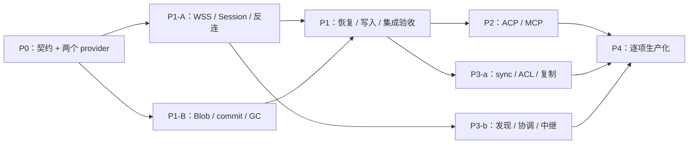

# conex 分阶段实现路线图

> 状态：P0 已交付（`e649ded`）；下一步是 [P1 执行计划](2026-09-15-conex-p1.md) 的首个工作包 P1-01 契约冻结。本文件只维护阶段、依赖与工作包，不重复执行级细节。

**Goal:** 在已交付的 broker 路由内核（P0）之上，按独立门槛增加反连、ACP/MCP 和可选 P2P。

**Architecture:** 以协议类型、方法契约和统一授权执行路径为主干。两个真实 provider 验证扩展性；Session/Stream、内容存储、协议桥接、sync 与发现分别形成可验收切片。设计尚未冻结的加密和 HA 规则先完成专项契约，再进入对应实现。

**Tech Stack:** Rust 2024、Tokio、prost/pbjson、TypeScript/Bun；HTTP 使用 Axum/Hyper 与 rustls；P0 不引入数据库、P2P 库或前端框架。后续数据库、加密与额外承载按阶段选择。

**Spec:** [conex 设计 v6](../design/2026-09-14-conex-design.md)，2026-09-15 快照 SHA-256：`1ffa0d73d858768c1802a2983c70234905a7cfea86edc6696b25982cb460eea6`。执行时若设计已变更，先核对受影响任务，不覆盖用户新修改。

## Global Constraints

以下约束来自设计，适用于所有阶段：

- “平面绑定能力端点与 Session，不能在同一 Session 内隐式转换。”
- “类型只维护一个源；状态机、映射及向量有明确优先级。”
- “本地拒绝时零目标连接；握手后拒绝时零业务请求和业务凭据。”
- “未进入当前交付阶段的方法不广告。”
- “禁止用重发 prompt 来代替 agent 输出恢复。”
- “P1/P2 保证进程存活且窗口内的网络重连。”
- “P3 首版不做多组织 ACL 共识：每个 Space 使用一个逻辑 ACL 权威；目录协调者不承担这一角色。”
- 不把传输 ACK 当作副作用完成；不把 CID、Session ID 或目录签名当作授权凭据。
- 本路线图列出所有阶段工作包；已完成的 [P0 执行计划](archive/2026-09-15-conex-p0.md) 归档在 `archive/`，[P1 执行计划](2026-09-15-conex-p1.md) 已细化到首个工作包 P1-01。P2–P4 的正式执行计划由各阶段首项任务产出，不提前编造尚未冻结的 wire/加密实现。

---

## 1. 当前基线与交付物

2026-09-15 仓库状态：分支 `refactor/arch`，P0 已在 `e649ded` 通过 `cargo xtask check` 交付；workspace 含 `conex-proto/core/source/provider-fs/transport-http/provider-http-catalog/assembly/host`、`sdk/typescript` 与 `xtask`，`conex-host` 是唯一装配根。实际操作环境记录与逐任务结果见 [P0 验证记录](../verification/p0.md)。`dev` 分支保留前一阶段 TypeScript CONEX 实现（见设计 §0.1），不进入本路线图交付物。

P0 的详细任务、文件与命令见归档计划；后续阶段只新增本路线图与对应阶段计划。所有任务必须保留设计文档及其他未跟踪文件；基准 diff 使用实际完成提交。

| 交付切片 | 用户可见结果 | 完成判断 |
|---|---|---|
| P0 ✅ | Rust 嵌入 API 和 HTTPS JSON-RPC 读取/搜索 fs、HTTP catalog | TS 客户端访问 fs（真实 E2E）；两个 provider 经同一 Registry/Host 路径（catalog 由集成与授权测试覆盖）；拒绝、空结果、部分失败可区分 |
| P1 | 私有 agent 反连、独立二进制上传、网络恢复、受控写入 | 1 GiB 续传、慢消费者、断线与未知副作用向量通过 |
| P2 | 真正可用的 ACP CLI 网关及 MCP 适配 | 双用户 workspace/权限/凭据隔离，原生协议保真 |
| P3-a | 自有空间加密历史与可迁移存储 | 冲突收敛、ACL 撤销、节点丢失及并发 GC 验证 |
| P3-b | 可选目录、局域网发现和受控中继 | 恶意目录不扩大权限，目录失联不破坏已有会话 |
| P4 | 单项生产能力 | HA、更多承载等各有独立收益、契约、测试和运维手册 |

## 2. 依赖与推进规则

这表示依赖关系，不自动授权并行 agent。默认串行完成当前任务再推进。P3-b 为 broker 服务时不依赖 P3-a；涉及空间成员时必须消费 P3-a 的已验证 ACL 结果。

每个工作包遵循：先写具体失败向量 → 最小实现 → 所声明能力的正反向测试 → 本任务评审和范围受控的提交。失败时修复该切片，不借下阶段功能掩盖。估时应在对应阶段首个工作包完成后按实际构建/集成反馈给出；不把未知集成成本写成确定日期。

## 3. P0：已交付（归档）

P0 执行计划与任务索引见 [archive/2026-09-15-conex-p0.md](archive/2026-09-15-conex-p0.md)，实际结果与缺口见 [P0 验证记录](../verification/p0.md)。关键检查点：

- [x] M0.1：单一类型源可生成 Rust、TS 和 JSON Schema，大整数/optional/消息变体向量一致。
- [x] M0.2：经过资源策略和审计的 inproc fs 调用可用；路径逃逸拒绝。
- [x] M0.3：HTTP catalog 增加后 core 无 provider 特判；TLS 验证先于业务秘密解析。
- [x] M0.4：HTTPS、HTTP binding 和 TS consumer 经同一路由路径调用两个 provider，故障隔离和全部 P0 验收通过。

P0 未创建空的 `conex-agent/node/coordinator` crate；接口仅随对应调用路径落地。P0 入站认证为管理员登记的静态 bearer 与可信嵌入身份；完整 JWT/OIDC 登录属于 P1 的浏览器入口工作，不伪装为已经支持。

## 4. P1：反连、二进制与恢复

**执行计划：** [2026-09-15-conex-p1.md](2026-09-15-conex-p1.md)。P1-01 契约冻结已细化到检查单；P1-02–P1-10 沿用下表，在 P1-01 退出后拆成可执行任务。

| 工作包 | 输入 | 输出位置与实现动作 | 验收证据 |
|---|---|---|---|
| P1-01 契约冻结 | P0 类型/路由 + 设计 §5–7 | `schema/conex/v1/session.proto`、`stream.proto`、`blob.proto`、`operation.proto`；冻结 manifest 树形、上传/commit 原子性、已知答案向量和持久记录后端 | 审查原始黄金字节、崩溃点列表；不得将 protobuf 普通序列化当规范化内容 |
| P1-02 WSS 引导 | P0 身份/Profile 注册 | `crates/conex-transport-ws/`；固定 64 KiB JSON 引导、hello/ready、JSON 与 protobuf Profile | 业务过早发送、重复 ready、版本/平面/方向能力不符均拒绝 |
| P1-03 Session/attachment | P1-01/02 | `crates/conex-core/src/session/`；固定身份/执行端点、每 attachment 租约与 epoch、显式 close/renew | 别人拿到 sessionId 无法恢复；UI 重连不替换 provider 连接；provider 心跳不能代替 consumer 续租 |
| P1-04 Stream | P1-03 | `crates/conex-core/src/stream/`；独立方向、累计信用、有界控制队列、缓存与 reset | 重放不增加信用；慢消费者停发；数据信用为零仍能取消；30 秒断网后窗口内恢复 |
| P1-05 反连 agent | P1-02/03 | `crates/conex-agent/`；已安装 provider 注册、host 身份校验、本地凭据解析 | 伪 host 无法取得注册/上游秘密；未授权 provider 不能注册；断线资源按租约回收 |
| P1-06 Blob 存储 | P1-01 + P0 CID | `crates/conex-content/`；块/staging/root/pin/租约、持久 commit、GC 与恢复日志 | 每个写入/commit/GC 崩溃点恢复后不会出现假 committed；跨资源同 CID 不共享访问权 |
| P1-07 Blob 流 | P1-04/06 | `crates/conex-content/src/transfer/`；缺块续传、检查 root/总长/全部可达块、inline/ref 转换 | 1 GiB 弱网续传；坏块拒绝；临时盘/内存有界；解码后字节往返相等 |
| P1-08 操作与写入 | P1-01 + P0 MethodContract | `crates/conex-core/src/operation/`；持久去重键/摘要/结果、operation/get、取消、只在真实原子条件下开放条件写 | 执行后响应丢失：可幂等上游取回原结果，无幂等上游返回 outcome_unknown，不重复执行 |
| P1-09 浏览器入口 | P0 HTTPS + P1-02/03 | `crates/conex-host/src/web_auth/`；OIDC code+PKCE、会话 cookie、Origin/CSRF、一次性 ticket | issuer/audience/nonce 错误拒绝；ticket 原子消费、30 秒到期、访问日志脱敏；Web 会话与业务 Session 区分 |
| P1-10 联合验收 | P1-02–09 | `conformance/vectors/p1/`、`docs/runbooks/p1.md` | 设计 §14 P1 七项逐项有测试名、命令和产物；host 重启明确 session_lost |

- [ ] 在 P1-01 中把每个工作包细分成独立测试周期并写入阶段计划；先评审存储事务与流控制的边界。
- [ ] P1-02 和 P1-06 分别形成可演示切片后再集成，不用空接口推进检查点。
- [ ] P1-10 完成前不广告网络恢复、持久 blob 或条件写能力。

## 5. P2：ACP 和 MCP

| 工作包 | 具体产出 | 必测失败场景 |
|---|---|---|
| P2-01 固定上游 | `docs/contracts/upstreams.md`、带版本/摘要的 `conformance/upstream/`；选定实际 ACP CLI、MCP server 和支持的登录方式；产出 P2 阶段执行计划 | 上游 schema 更新不会静默改变已固定向量；没有安装 CLI 时不以 mock 代替真实集成验收 |
| P2-02 ACP 消息桥 | `crates/conex-adapter-acp/src/{codec,ids,lifecycle}.rs`；消息/错误/外部 ID/_meta 映射，两侧独立初始化 | 双向相同外部 ID、未知必需字段、通知被错误响应、重复 initialize |
| P2-03 私有进程与 workspace | `crates/conex-agent/src/acp/`；每 Session 独占进程、stdout 协议/stderr 有界、fs/terminal 受限执行 | 目录穿越、两个用户的路径/环境变量串用、租约过期后的进程组回收 |
| P2-04 human 回调 | `crates/conex-core/src/callback/` 与最小交互 consumer；批准绑定父调用/参数/期限 | 另一个窗口或用户批准、旧批准重放、界面断线后默认允许 |
| P2-05 认证 | ACP agent/terminal auth 状态机、私有侧登录入口、正确 `logout` 映射 | terminal methodId 不发 authenticate；登录进程非零退出；日志泄密；对其他 Session 注销 |
| P2-06 输出与恢复 | ACP prompt 到 Stream 的转换、transcript 可用性声明、输出缺口提示 | 超窗不重跑 prompt；进程死亡返回 session_lost；失联租约内保留进程 |
| P2-07 MCP | `crates/conex-adapter-mcp/`；按固定版本实现初始化、HTTP/stdio 桥接和内容/错误转换 | 不支持的能力不广告；不能把 MCP SSE 直接当完整 conex 双向恢复协议 |
| P2-08 真实验收 | `tests/e2e/acp/`、`tests/e2e/mcp/`、双用户脚本与运行手册 | 一个会话失败不影响另一个；完成设计 §14 P2 六项 |

- [ ] 先完成 P2-01，再根据真实上游能力拆细其余实现任务。
- [ ] 真实 CLI 的启动命令来自管理员安装配置，不从远端清单或页面输入读取。
- [ ] ACP/MCP 两个桥接器都通过核心授权路径，无绕过 Registry 的捷径。

## 6. P3-a：sync 与零知识存储

| 工作包 | 必须产出 | 发布门槛 |
|---|---|---|
| P3a-01 专项契约 | `docs/design/<日期>-conex-sync.md`；加密套件、nonce/派生/封装、规范化字节、签名 domain、cutoffHeads、合并规则、存储原子性；对应执行计划 | 算法/格式不是任意拼接的配置项；有独立安全评审和跨语言已知答案向量 |
| P3a-02 Space/ACL | `crates/conex-sync/src/{space,acl}/`；genesis、单权威版本链、防双主/回退、60 秒证明及 5 秒时钟容差 | 权威分叉冻结新授权；撤销写但不换密钥同样截断旧权限迟到写 |
| P3a-03 加密内容 | `crates/conex-sync/src/crypto/`；设备侧密钥、密文封装、签名 roots | 节点无明文/解密密钥；元数据暴露符合契约；错误 nonce/tag/密钥 epoch 拒绝 |
| P3a-04 对象历史 | `crates/conex-sync/src/object/`；object-mv-v1、父依赖暂存、多值冲突、tombstone、显式解决 | 乱序/重复/分批输入收敛；离线同属性写不被覆盖；未知 schema 不投影为空对象 |
| P3a-05 Node/副本 | `crates/conex-node/` 与 content 后端；独立故障域持久接收、完整性检查与补副本 | local 与 replicated(n) 不混淆；只有 heads/密钥而无副本时返回缺块 |
| P3a-06 迁移 | `crates/conex-sync/src/migration/`；保留源、复制可达集、追增量、切换、释放 pin | 并发 GC 与源节点失联；目标未完整前不能释放源 |
| P3a-07 演练 | `tests/e2e/sync/`、密钥备份/恢复/权威切换手册 | 设计 §14 P3-a 五项及旧明文无法远程追回的准确产品语义 |

- [ ] P3a-01 完成后才开始 P3-a 实现；P0–P2 不等待此门槛。
- [ ] 禁止把源码中没有密钥字符串或存储“看起来像乱码”作为唯一加密验收。

## 7. P3-b：发现、目录与中继

| 工作包 | 具体产出 | 验收 |
|---|---|---|
| P3b-01 契约与计划 | `docs/design/<日期>-conex-discovery.md`；Candidate、信任根来源、租约/墓碑、元数据查询范围及执行计划 | 单目录与多目录撤销/缓存边界可区分 |
| P3b-02 静态/mDNS | `crates/conex-discovery/src/{static_config,mdns,cache}.rs` | 默认不广播；开启后仍须身份授权；缓存包含租户/plane/目标约束 |
| P3b-03 Coordinator | `crates/conex-coordinator/`；announce/query/space/hint/revoke、序号、防重放和范围控制 | 180 秒租约、revoke 本地即时移除、旧 announce 不复活、查询不能跨租户枚举 |
| P3b-04 候选准入 | discovery 通过既有 TargetPolicy/Connector，不另写业务拨号路径 | 预检失败零拨号；TLS/hello 失败零业务请求/秘密；协调者签名不能替代预期 peer 身份 |
| P3b-05 中继连通 | 受控 WSS 隧道、独立地址准入、端到端保护、连接失败退避 | 打洞失败不声称连通；只回退已授权中继；杀掉目录不破坏已有有效会话 |

- [ ] P3b-01 后产出具体实施任务；不在目录中新增 ACL 定序或上游凭据存储职责。
- [ ] broker 发现可以先交付；`discover/space` 的可信成员判断在 P3-a 接通后才广告。

## 8. P4：按需求逐项立项

每个能力单独产出设计、执行计划和验收，不用一个“生产化完成”勾选框包办：

| 能力 | 启动依据 | 具体前置与验收 |
|---|---|---|
| keyring/凭据 broker | env/file 运维或轮换成本成为问题 | 迁移、撤销、受众绑定、回滚不泄密 |
| 审计查询/外送 | 需要集中运维 | 访问控制、保留、背压、敏感字段脱敏，不影响副作用幂等 |
| HA/跨进程恢复 | 明确的可用性/RPO/RTO 目标 | 共享状态、Session 归属、fencing、灾难恢复；不能只加负载均衡 |
| 双平面索引 | 明确需要 relay 数据中心检索 | 显式导出授权、派生内容版本、停止未来导出及缓存清理 |
| QUIC/WebTransport | 弱网/移动测量证明收益 | 独立 Profile、能力矩阵、Stream 映射、浏览器与代理回退 |
| SSE+POST | 部署环境确实阻断 WSS | 双向关联、绑定、取消、恢复向量，不能降级丢语义 |
| DHT | 静态/目录规模或去中心需求 | 隐私、投毒、限流、可信身份独立验证；保持可关闭 |
| 进程池 | ACP 独占进程成本有测量证据 | 登录/workspace/权限隔离不变，单会话退出不杀共享进程 |

## 9. 追踪与完成定义

- [ ] 每次实现结束更新对应执行计划任务框，只在测试真实通过后标记；本文件阶段框只在整个检查点完成后勾选。
- [ ] `docs/verification/<阶段>.md` 记录 commit、环境、命令、结果和故障注入证据。生成文件不一致、未知能力被广告或安全路径绕过均阻止该阶段完成。
- [ ] 每次提交仅包含当前任务文件；实现期间修改既有符号遵循适用 AGENTS.md 的影响分析要求。
- [ ] 初版只交付本地可运行软件和文档；公开发布包、部署服务或迁移真实用户数据是单独动作。

P0 已完成，下一步执行 [P1 执行计划](2026-09-15-conex-p1.md)；不以启动全部阶段衡量进度。P0 完成后优先选择能验证实际需求的反连/ACP 或内容切片，再进入对应阶段计划。
